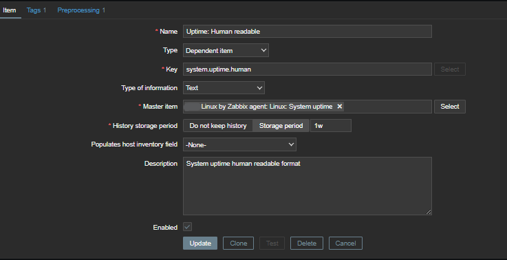
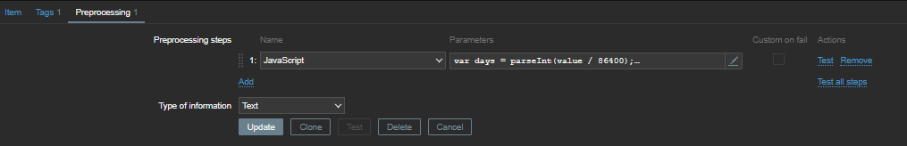

# Zabbix Email HTML Templates with your company logo


## Description  
These HTML templates for Zabbix notifications are designed to enhance the user experience by using improved message templates.  


## Table of Contents  

<!-- TOC tocDepth:2..3 chapterDepth:2..6 -->

- [Zabbix Email HTML Templates with your company logo](#zabbix-email-html-templates-with-your-company-logo)
  - [Description](#description)
  - [Table of Contents](#table-of-contents)
  - [Requirements](#requirements)
  - [HTML Email Notification Templates](#html-email-notification-templates)
    - [Template Views](#template-views)
    - [Installation and Usage](#installation-and-usage)

<!-- /TOC -->

## Requirements  
- Zabbix >= 6.4  


## HTML Email Notification Templates

### Template Views    


### Installation and Usage  

1. Add your company logo and name to the files in the `html_templates` folder by changing lines 16, 18, 19, and 203:  
   ```bash
    <a href="https://www.YOUR_COMPANY.com" style="text-decoration:none" # replace with your company website
    
   ```

2. Insert the template texts in the Zabbix WEB-UI: *Alerts -> Media types -> Email (HTML) -> Message templates*     
     

3. The title format for email templates:  
       - *your_company_problem_template*: `Problem: {HOST.NAME}: {EVENT.NAME}`  
       - *your_company_resolve_template*: `Resolved in {EVENT.DURATION}: {EVENT.NAME}`   
       - *your_company_problem_update_template*: `Updated problem in {EVENT.AGE}: {EVENT.NAME}`  

4. To display Uptime in the template, you need to create a dependent item from `system.uptime` and configure preprocessing.
   
   
     

   ```bash
    var days = parseInt(value / 86400);
    value = value % 86400;
    var hours = parseInt(value / 3600);
    if (hours < 10){
    hours = "0" + hours;
    }
    value = value % 3600;
    var minutes = parseInt(value / 60);
    if (minutes < 10){
    minutes = "0" + minutes;
    }
    var seconds = value % 60;
    if (seconds < 10){
    seconds = "0" + seconds;
    }
    value = days +" days, " + hours + ":" + minutes + ":" + seconds;
    return value;
   ```
